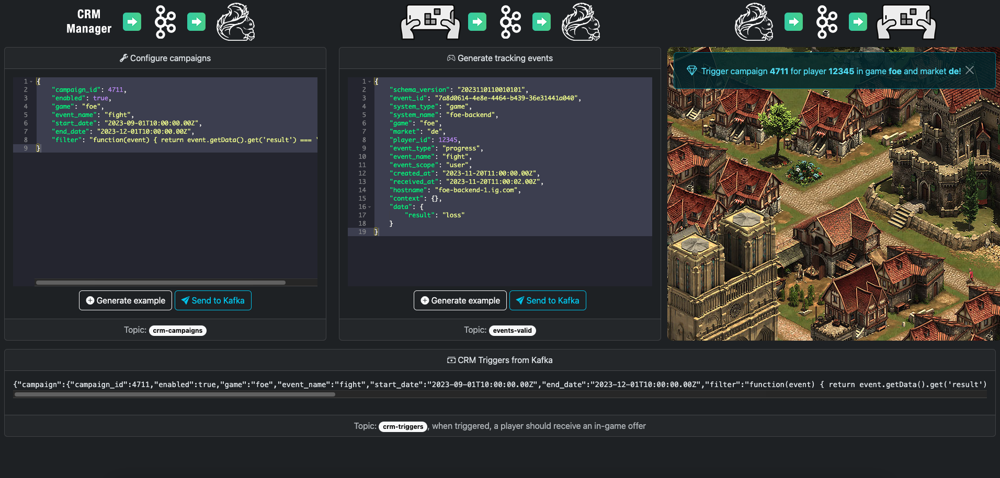

# Real-time Customer Engagement in Gaming Using Kafka and Flink

## Description
Demo UI for the [Flink real-time CRM project](https://github.com/innogames/flink-real-time-crm) using Spring Boot with
Thymeleaf.

The Demo UI is able to send messages to and consume from the related Kafka topics.

## Local Execution
* Clone [Flink real-time CRM project](https://github.com/innogames/flink-real-time-crm)
* Start Kafka and Flink as described in the [README](https://github.com/innogames/flink-real-time-crm/blob/main/README.md)
* Start `com.innogames.analytics.rtcrm.App`
* Navigate to `localhost:7071`
